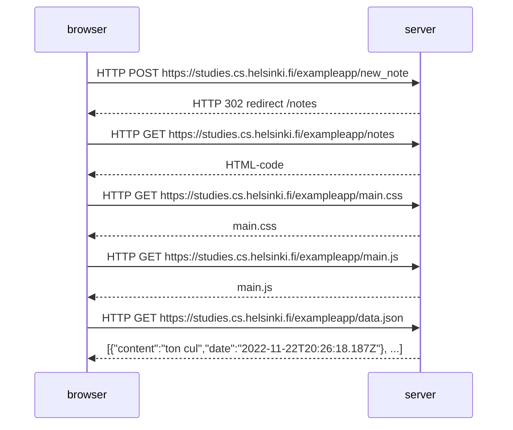

```mermaid
sequenceDiagram
browser ->> server: HTTP POST https://studies.cs.helsinki.fi/exampleapp/new_note
server -->> browser: HTTP 302 redirect /notes
browser ->> server: HTTP GET https://studies.cs.helsinki.fi/exampleapp/notes 
server -->> browser: HTML-code
browser ->> server: HTTP GET https://studies.cs.helsinki.fi/exampleapp/main.css
server -->> browser: main.css
browser ->> server: HTTP GET https://studies.cs.helsinki.fi/exampleapp/main.js
server -->> browser: main.js
browser ->> server: HTTP GET https://studies.cs.helsinki.fi/exampleapp/data.json
server -->> browser: [{"content":"ton cul","date":"2022-11-22T20:26:18.187Z"}, ...]
```
